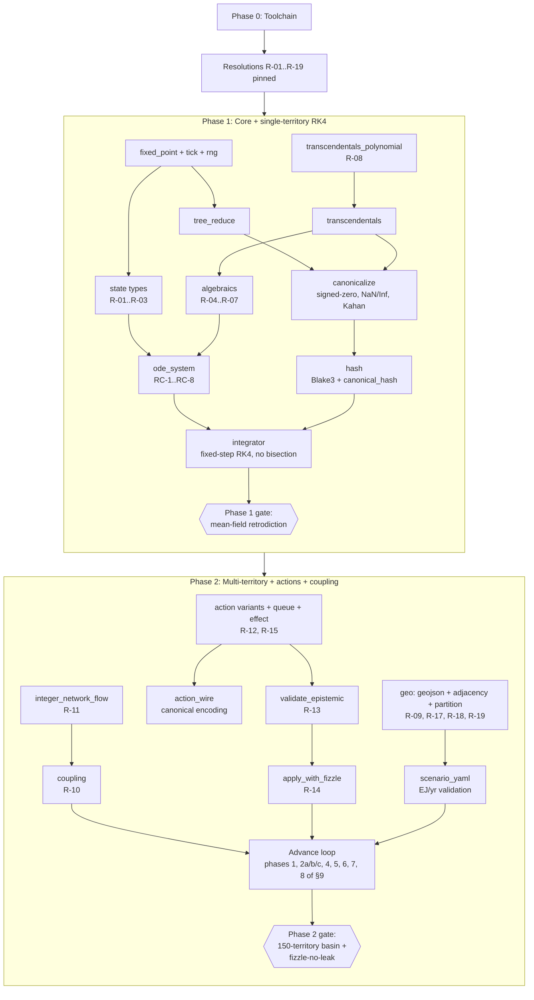

# Phase 0–2 Execution Plan

**Source:** `docs/DESIGN_v1.3.md` §19 (revised phase plan).
**Resolutions input:** `docs/SPEC_AMBIGUOUS_RESOLUTIONS.md` (authored separately; **prerequisite to Phase 0 exit**).
**Scope:** Phase 0 (1 wk) + Phase 1 (6 wk) + Phase 2 (5 wk) = 12 weeks. This is the AEGIS §3-recommended first binding commitment per §19. End-of-Phase-2 produces a complete v5-in-executable-form proof-of-concept with cross-platform deterministic CI green; tech-report publishable; re-evaluate before phase 3+.

---

## §1 Context

The v1.3 scaffold is in place: every header, .cpp stub, test stub, CMake skeleton, and CLI driver exists. No code compiles yet — `FetchContent` URLs are blank, `FetchContent_MakeAvailable` is commented out, function bodies are empty, tests carry `[pending]` Catch2 tags with `REQUIRE(false)`. Phase 0–2 fills the scaffold up to the §19 Phase-2 gate ("150-territory run reaches basin; fizzle-no-leak test passes").

Seven v1.3 corrections are load-bearing in this block and must not be reintroduced as bugs:
- **§2.2** energy in EJ/yr (not J/yr) — Q-format would overflow otherwise.
- **§2.6** signed-zero canonicalization + NaN/Inf trap before hashing.
- **§2.7** Kahan-style quantization residual sidecar — preserves First Law across 30-yr runs.
- **§4.5** Padé [6/6] polynomial as primary path; pinned `Sleef_exp_u10` scalar fallback only.
- **§4.6** Integer Network Flow (no FP LP) for coupling.
- **§5.4** split validation: `validate_epistemic` against observation, then `apply` with Fizzle path against ground truth.
- **§8.2** abolished intra-tick bisection; gates evaluated once at tick boundary, held constant across RK4 substages.

The v1.3-determinism CI (parallel hash == sequential hash across 1/4/16/64 threads, cross-compiler bit-identity) is the spine; every phase gate is a CI condition.

---

## §2 Resolution prerequisite (Phase 0 blocker for downstream phases)

The scaffold contains 35 `SPEC_AMBIGUOUS` markers. Each must have a corresponding entry in `docs/SPEC_AMBIGUOUS_RESOLUTIONS.md` **before** the phase that depends on it can start. This plan does not resolve ambiguities — see resolutions doc.

### Phase 1 blockers (must be resolved before Phase 1 starts)

| Marker | §  | Location | What's unclear |
|---|---|---|---|
| R-01 | §3.1 | `include/rcsim/state/territory.hpp:13` | Integer width of `TerritoryId`/`PrincipalId` |
| R-02 | §3.1 | `include/rcsim/state/territory.hpp:44` | `_pad[32]` size depends on R-01 |
| R-03 | §3.3 | `include/rcsim/state/global_state.hpp:17` | Full enumeration of `ParamBlock` fields |
| R-04 | §4.1 | `include/rcsim/dynamics/algebraics.hpp:46`, `src/dynamics/algebraics.cpp:23` | `e_U(ν)` functional form |
| R-05 | §4.1 | `include/rcsim/dynamics/algebraics.hpp:51`, `src/dynamics/algebraics.cpp:28` | `ξ(D_global)` functional form |
| R-06 | §4.2 | `include/rcsim/dynamics/algebraics.hpp:35`, `src/dynamics/algebraics.cpp:13` | `η` derived-quantity formula |
| R-07 | §4.2 | `include/rcsim/dynamics/algebraics.hpp:41`, `src/dynamics/algebraics.cpp:18` | `φ` derived-quantity formula |
| R-08 | §4.5 | `include/rcsim/core/transcendentals_polynomial.hpp:12`, `src/core/transcendentals_polynomial.cpp:5` | Padé [6/6] coefficients |

### Phase 2 blockers (must be resolved before Phase 2 starts)

| Marker | §  | Location | What's unclear |
|---|---|---|---|
| R-09 | §3.5 | `include/rcsim/state/world_state.hpp:66` | `AdjacencyGraph` by-value vs pointer |
| R-10 | §4.3 | `include/rcsim/dynamics/coupling.hpp:13` | Pinned values for η_l→e (≈0.35), η_e→l (≈0.6) |
| R-11 | §4.6 | `include/rcsim/state/world_state.hpp:31` | `CouplingGraph` structure (edge list + flow representation) |
| R-12 | §5.2 | `include/rcsim/state/pending.hpp:17` | `ActionLogId` width |
| R-13 | §5.4 | `include/rcsim/action/validate_epistemic.hpp:24` | Reason-code enum for `ValidationResult` |
| R-14 | §5.4 | `include/rcsim/action/apply_with_fizzle.hpp:22` | Reason-code enum for `ApplyResult` (shared with R-13) |
| R-15 | §6.2 | `include/rcsim/observer/measurement.hpp:19` | `ObservationField` enum closure (referenced by `ManipulateObservation` in Phase 2 even though full observer is Phase 3) |
| R-16 | §10.1 | `include/rcsim/state/world_state.hpp:44` | `ActionLogEntry` field layout (needed for action_log_delta even if sync-log writer is Phase 4) |
| R-17 | §12 | `include/rcsim/geo/geojson.hpp:15` | GeoJSON schema accepted by loader |
| R-18 | §18 | `include/rcsim/geo/partition.hpp:4` | Whether `partition.cpp` exists at all (and if yes, its purpose) |
| R-19 | §18 | `include/rcsim/geo/adjacency.hpp:32` | Coordinate snapping grid for shared-edge test |

### Out-of-block (informational only — Phase 3+, not required to start Phase 2)

R-20..R-29: §6.1, §6.3 (×2), §6.4, §7.3 (×2), §10.1 cadence K, §11.1 (×3), §14 Windows IPC. Listed in resolutions doc but do not block the Phase 0–2 commitment.

**Phase 0 cannot exit until Phase-1 + Phase-2 blockers (R-01..R-19) are resolved in `docs/SPEC_AMBIGUOUS_RESOLUTIONS.md`.**

---

## §3 Dependency DAG



Within Phase 1, the bottom row (algebraics → ode_system → integrator) is the critical path; everything else can run in parallel with it.
Within Phase 2, the four columns (`integer_network_flow`/`coupling`, action stack, geo/scenario, advance-loop wiring) are independent until they meet at the Advance-loop integration step.

---

## §4 Phase 0 — Toolchain (1 week)

**Goal:** make the scaffold build and run on every CI cell. No simulation behavior added.

### Tasks

| # | File / area | Task |
|---|---|---|
| 0.1 | `CMakeLists.txt` lines 36–74 | Pin `URL` (and `URL_HASH SHA256=...`) for **blake3, pcg, sleef, lemon, ryml, nlohmann_json, arrow, catch2** — versions chosen deliberately, pin SHA256 of every download |
| 0.2 | `CMakeLists.txt` line 80 | Uncomment `FetchContent_MakeAvailable(blake3 pcg sleef lemon ryml nlohmann_json arrow catch2)` |
| 0.3 | `CMakeLists.txt` lines 159–161 | Uncomment `target_link_libraries(rcsim-core PUBLIC blake3 pcg sleef lemon ryml nlohmann_json::nlohmann_json arrow_static parquet_static)` |
| 0.4 | `tests/CMakeLists.txt` lines 7–11, 28–31 | Wire Catch2 v3: `find_package(Catch2 3 REQUIRED)`, `include(CTest)`, `include(Catch)`; link `Catch2::Catch2WithMain`; call `catch_discover_tests` per target |
| 0.5 | `tests/CMakeLists.txt` line 38 | Keep `LABELS pending` so CI can `ctest -LE pending` to skip in-flight tests |
| 0.6 | `.github/workflows/` (new) | CI matrix per §15.1: GCC 13 (Linux x86_64, Linux aarch64), Clang 17 (Linux x86_64, macOS arm64), MSVC 19.40 (Windows x86_64). Run `cmake -S . -B build && cmake --build build && ctest --test-dir build -LE pending && ./build/rcsim-run --help` per cell |
| 0.7 | `tools/rcsim_run.cpp` | Already prints help; verify `rcsim-run --help` exits 0 unmodified |
| 0.8 | `docs/SPEC_AMBIGUOUS_RESOLUTIONS.md` | **Must exist with R-01..R-19 resolved** before exit |

### Phase 0 gate

All CI cells green on:
```
cmake -S . -B build -DCMAKE_BUILD_TYPE=Release
cmake --build build --parallel
ctest --test-dir build -LE pending --output-on-failure
./build/rcsim-run --help     # exits 0
```
And: `docs/SPEC_AMBIGUOUS_RESOLUTIONS.md` contains entries R-01..R-19 (Phase-1 + Phase-2 blockers).

---

## §5 Phase 1 — Core + single-territory integration (6 weeks)

**Goal:** core determinism primitives + RK4 + single-territory integration produce the simplified v5 mean-field retrodiction. Multi-territory, actions, and observer remain stubs.

### Task breakdown by file

| Week | File | Task | Resolution dep |
|---|---|---|---|
| 1 | `src/core/tick.cpp` | `TickNumber` arithmetic helpers; weeks-to-years conversion | — |
| 1 | `src/core/fixed_point.cpp` | `quantize_Q32_32` / `Q48_16` / `Q56_8` and `dequantize_*` per §2.2 table; `saturation_ratio_*` per §8.3 (warn at 0.95, halt at 1.0) | — |
| 1 | `src/core/rng.cpp` | `Pcg64` ctor from seed and `(scenario_seed, RngSubstream)`; `next_uint64`, `next_double` (canonical [0,1) conversion); `Philox4x32::generate` (10 rounds); `make_counter`, `to_double`; `derive_substream_seed` via Blake3-256 truncation per §2.3 | — |
| 1 | `src/core/tree_reduce.cpp` (header) | Implement template body inline per §2.4 reference: `bit_ceil`, pad with `IdentityFor<Op>::value`, fixed-pair stride; ensure `SumDouble`/`SumWeighted` specializations work | — |
| 1 | `src/core/transcendentals_polynomial.cpp` | Padé [6/6] coefficients **from R-08**; `polynomial_exp_bitexact` strictly bit-exact under IEEE-754 in `[-50, 50]` | R-08 |
| 1–2 | `src/core/transcendentals.cpp` | `exp_canonical` (poly path then `Sleef_exp_u10` fallback); `pow_canonical` via `exp(b * log(a))`; `log_canonical` (pinned scalar Sleef + polynomial common range) | — |
| 2 | `src/core/canonicalize.cpp` | `canonicalize_for_hash`: signed-zero strip + `isfinite` trap; `trap_nonfinite` halts with field diagnostic; `canonicalize_state_with_residual` per-field per-territory (`augmented = unq + prev_residual`, `quantized = quantize(augmented)`, `new_residual = augmented - quantized`) | — |
| 2 | `src/core/hash.cpp` | Blake3-256 incremental hasher; `canonical_hash(WorldState)` walks territory grid in `(territory_id)` order, applies `canonicalize_for_hash` per double, feeds bytes via `deterministic_tree_reduce` over per-territory hashes; `StateHash::operator==/!=`; `hash_chain_link(prev, current)` | — |
| 2 | `src/state/territory.cpp` | Default ctor; assert `sizeof(TerritoryState) == 128` after R-01/R-02 resolution | R-01, R-02 |
| 2 | `src/state/global_state.cpp` | `ParamBlock` field initialization per **R-03** | R-03 |
| 2 | `src/state/canonicalization_state.cpp` | Resize all 9 residual vectors to N on world init; zero-init | — |
| 2 | `src/state/world_state.cpp` | `state_hash` forwards to `core::canonical_hash`; default ctor sizes grid + residuals consistently | — |
| 2 | `src/state/principal.cpp`, `src/state/pending.cpp` | Minimal default ctors; full flesh-out is Phase 2 | — |
| 3 | `src/dynamics/algebraics.cpp` | `Theta_soft`, `Pi_hard` (already inline-defined in header); `rho` Hill function via `pow_canonical`; **`eta`, `phi` per R-06/R-07; `e_U` per R-04; `xi_of_D` per R-05** | R-04..R-07 |
| 3–4 | `src/dynamics/ode_system.cpp` | Per-territory `derivative` implementing RC-1..RC-8 from §4.1 (NB: `convert`/`flux` terms read from `WorldState::coupling` as constants; in Phase 1 they're zero); `rhs` populates `out_deriv` in territory_id order, parallelizable per-territory; `gamma_kinetic` per §4.4; `evaluate_gates` populates `theta_elec`/`pi_crit`/`theta_supply` once per tick from tick-boundary state | depends on R-03..R-07 |
| 4 | `src/dynamics/integrator.cpp` | `Rk4Integrator::step` runs 4 substages with `dt = dt_years / substeps_per_tick`, gates closed-over constant; **must not contain any bisection logic** (test 15 enforces); `integrate_rk4_fixed_step` is the spec's named entry point | — |
| 4 | `src/political/regime.cpp` | Enum-to-string helpers only; §7.3 default response latencies deferred to Phase 3 | — |
| 4 | `tools/rcsim_run.cpp` | Add `--scenario` path that loads a hard-coded mean-field scenario (N=1 placeholder; full YAML in Phase 2), runs N ticks, prints final state hash | — |
| 5 | `tests/determinism/01_identical_rerun.cpp` | Run same scenario twice in one process; `REQUIRE` per-tick `StateHash` equality | — |
| 5 | `tests/determinism/03_cross_platform_hash.cpp` | Compare against committed golden hash (one per CI cell per scenario) | — |
| 5 | `tests/determinism/05_fpu_mode_robustness.cpp` | Set MXCSR/FPCR to non-default modes, hash invariant | — |
| 5 | `tests/determinism/07_pinned_sleef_variant.cpp` | Symbol-table grep / link-time check that only `Sleef_exp_u10` (scalar) is referenced | — |
| 5 | `tests/determinism/10_signed_zero_canonicalization.cpp` | Inject `-0.0` into a field; assert hash matches `+0.0` baseline | — |
| 5 | `tests/determinism/11_nan_inf_trap.cpp` | Inject NaN/Inf; assert `trap_nonfinite` halts with diagnostic | — |
| 5 | `tests/determinism/12_kahan_residual_conservation.cpp` | Run 30-yr (1560 ticks) with sub-LSB derivative; assert Σ field preserved within Kahan tolerance | — |
| 5 | `tests/determinism/15_bisection_absent.cpp` | Source-grep + symbol-grep for `bisect`/`bisection`; `REQUIRE(false)` if found | — |
| 6 | `tests/property/Q_nonneg_monotone_gates.cpp`, `A_monotone.cpp`, `D_monotone.cpp` | Random-init + 100-tick run; per-tick assertions | — |
| 6 | `tests/property/hash_stability.cpp` | Idempotent re-canonicalization | — |
| 6 | `tests/property/tree_reduce_commutativity.cpp` | Permute input; assert reduction equal across permutations sized to same power-of-two padding | — |
| 6 | `tests/property/conservation.cpp` | 30-yr Σ-mass / Σ-energy / Σ-fiat preserved with Kahan residual | — |
| 6 | `scenarios/mean_field_1.yaml` (new) | N=1, gates fixed, analytical solution available | — |

### Phase 1 gate

```
ctest --test-dir build -L determinism                # tests 01,03,05,07,10,11,12,15 green
ctest --test-dir build -L property                   # 6 listed property tests green
./build/rcsim-run --scenario scenarios/mean_field_1.yaml --ticks 1560
# Compare RMSE of trajectory vs analytical mean-field solution within tolerance ε
# (tolerance committed in scenarios/mean_field_1.yaml as `tolerance_rmse`)
```
Cross-platform: identical final hash on every CI cell.

---

## §6 Phase 2 — Multi-territory + actions + coupling (5 weeks)

**Goal:** the §9 advance loop (minus observer/sync-log) operates on a 150-territory grid with action ingestion, Integer Network Flow coupling, Fizzle-aware apply.

### Task breakdown by file

| Week | File | Task | Resolution dep |
|---|---|---|---|
| 1 | `src/core/integer_network_flow.cpp` | LEMON `NetworkSimplex` adapter on int64 Q-format **or** custom push-relabel (~500 LOC); `add_edge` lex-sorts insertion by `(src_id, dst_id)`; `solve` returns `FlowResult` parallel to edge-input order; tie-break: lexicographically smallest path | — |
| 1 | `src/dynamics/coupling.cpp` | `compute_conversion_flows` with **R-10 η values**; `integer_network_flow_solve` constructs the per-tick network (territories × adjacency-edges × Q-format integer capacities/costs) and writes to `WorldState::coupling`; `blockade`, `migration_flux` (linear v1) | R-10 |
| 1 | `src/state/world_state.cpp` | `CouplingGraph` populated per **R-11** (edge list + per-edge flow + per-territory net-flow aggregates) | R-11 |
| 1 | `src/state/world_state.hpp` follow-up | Resolve `AdjacencyGraph*` → by-value per **R-09** (or keep pointer if R-09 says so) | R-09 |
| 1 | `src/state/pending.cpp` | `ActionLogId` typed per **R-12**; flesh out 10 PendingEffect variants (BlockadeEdge, ExportControlFlow, TerritoryOwnerFlip, CapacityRamp, ShockImpulse, DistortionBudget, AttributionBudget, GateTransition, RegimeTransition, FizzleRecord) | R-12 |
| 2 | `src/action/action.cpp` | Flesh out 17 variant structs per §5.1 (full field sets, default ctors); `ManipulateObservation` references `ObservationField` (R-15) | R-15 |
| 2 | `src/action/queue.cpp` | `ActionCompare`: `(tick, principal_id, action_seq)` ascending; `resolve_conflicts`: priority desc → principal_id asc, loser → `Pass{reason}` | — |
| 2 | `src/action/effect.cpp` | `mature_pending` and `retire_expired` walk `WorldState::pending` in canonical order, applying mutation variants | — |
| 2 | `src/action/action_wire.cpp` | `serialize_canonical(Action)` and `deserialize_canonical` per §10.1a: explicit LE for scalars, `uint32` len-prefix + UTF-8 for strings, `uint32` LE for enums (frozen at schema_major; unknown → hard halt with `unknown enum value N at schema_minor M`); reflection-free, no implicit padding | — |
| 3 | `src/action/validate_epistemic.cpp` | Per-action-variant validators read from `Observation` only (never `WorldState`); return `ValidationResult{ok, reason}` with reason from **R-13 enum** | R-13 |
| 3 | `src/action/apply_with_fizzle.cpp` | `deduct_resources` mutates `PrincipalState` unconditionally; `apply` checks ground-truth feasibility per variant, returns `ApplyResult{state, applied, fizzled, reason}` with reason from **R-14 enum** (shared with R-13); fizzle path emits `FizzleRecord` PendingEffect, no physical mutation | R-14 |
| 3 | `src/geo/geojson.cpp` | nlohmann_json parser per **R-17 schema**; coordinate-snap to integer grid per R-19; emit `GeoLoadResult{polygons, ids}` | R-17, R-19 |
| 3 | `src/geo/adjacency.cpp` | `derive_adjacency`: pairwise polygon shared-edge test on snapped coords; lex-sort `(min(a,b), max(a,b))`; populate per-territory neighbor lists | R-19 |
| 3 | `src/geo/partition.cpp` | Per **R-18**: implement if resolution keeps the file; remove from CMake otherwise | R-18 |
| 3 | `src/io/scenario_yaml.cpp` | rapidyaml loader per §12: `scenario_seed`, principals (regime/clock placeholder), `territory_overrides` (r, H, G, M, Npop, S, Qelec, Qliq, D_local), `scripted_actions`. **EJ/yr validation**: warn if any `Qelec`/`Qliq` value exceeds 1e15 — likely user left v1.2 J/yr units. `migrate_scenario_v1_2_to_v1_3` divides energy fields by 1e18 | — |
| 4 | `tools/rcsim_run.cpp` | Implement Advance-loop driver: §9 phases 1 (mature_pending), 2a (sort+epistemic-validate), 2b (deduct), 2c (apply+fizzle), 4 (`integer_network_flow_solve`), 5 (`evaluate_gates`), 6 (RK4 step), 7 (canonicalize), 8 (retire_expired), 9 (hash). Phases 3 (observer) and 10 (sync-log write) remain stubbed — observer returns `TruthfulMeasurement`, sync-log is no-op | — |
| 4 | `tests/determinism/04_action_order_invariance.cpp` | Permute inbound actions; sorted-canonical hash invariant | — |
| 4 | `tests/determinism/08_action_wire_roundtrip.cpp` | `deserialize(serialize(a)) == a` bit-identical for every variant across all 3 compilers | — |
| 4 | `tests/determinism/13_integer_network_flow_determinism.cpp` | Same supply/demand network solved on all CI cells → bit-equal `FlowResult` | — |
| 4 | `tests/determinism/14_fizzle_no_ground_truth_leak.cpp` | Two scenarios with identical principal observations but different ground truths → identical set of validated-and-deducted actions; apply outcomes diverge | — |
| 4 | `tests/property/action_log_replayability.cpp` | Serialize action log → reload → re-run → same hash sequence | — |
| 4 | `tests/property/epistemic_validation_no_leak.cpp` | Property: validator's output depends only on `obs`, never on `WorldState` | — |
| 5 | `scenarios/150_territory.yaml` (new) | N=150 from a calibrated GeoJSON fixture; principals seeded; some scripted actions | — |
| 5 | Integration | `cmake --build build` clean across full CI matrix; full Advance-loop run on 150-territory scenario completes 1560 ticks with no saturation halt and no NaN/Inf trap | — |

### Phase 2 gate

```
ctest --test-dir build -L determinism      # tests 01,03,04,05,07,08,10,11,12,13,14,15 green
ctest --test-dir build -L property         # all 8 implemented property tests green
./build/rcsim-run --scenario scenarios/150_territory.yaml --ticks 1560
# Exit 0; final hash bit-identical across full CI matrix; trajectory reaches basin
# (committed criterion: ||state[1560] - state[1559]||_∞ < ε_basin)
```

---

## §7 Per-phase gate criteria (summary)

| Phase | Hard gates | CI command |
|---|---|---|
| **0** | All FetchContent URLs pinned w/ SHA256; `FetchContent_MakeAvailable` enabled; Catch2 wired; full CI matrix (5 cells per §15.1) builds clean; `rcsim-run --help` exit 0; `docs/SPEC_AMBIGUOUS_RESOLUTIONS.md` covers R-01..R-19 | `cmake --build build && ctest -LE pending && ./build/rcsim-run --help` |
| **1** | Determinism tests 01, 03, 05, 07, 10, 11, 12, 15 green; property tests Q_nonneg, A_monotone, D_monotone, hash_stability, tree_reduce_commutativity, conservation green; mean-field RMSE ≤ tolerance committed in scenario | `ctest -L determinism -L property && ./build/rcsim-run --scenario scenarios/mean_field_1.yaml` |
| **2** | All Phase-1 gates still green; determinism tests 04, 08, 13, 14 added green; property tests action_log_replayability, epistemic_validation_no_leak green; 150-territory run completes 1560 ticks; basin reached; cross-platform final-hash bit-identical | `ctest -L determinism -L property && ./build/rcsim-run --scenario scenarios/150_territory.yaml` |

CI gate (every cell, every phase): **`parallel_hash == sequential_hash` across 1/4/16/64 threads** (§2.4).

---

## §8 Verification

### Local dev loop

```bash
cmake -S . -B build -DCMAKE_BUILD_TYPE=Release
cmake --build build --parallel
ctest --test-dir build -LE pending --output-on-failure
./build/rcsim-run --help
./build/rcsim-run --scenario scenarios/mean_field_1.yaml      # Phase 1 gate
./build/rcsim-run --scenario scenarios/150_territory.yaml      # Phase 2 gate
```

### CI matrix expectations (per §15.1)

| Cell | Compiler | Platform | Optimization | Must-pass |
|---|---|---|---|---|
| 1 | GCC 13 | Linux x86_64 | -O2, -O3 -march=native | All gates per phase |
| 2 | GCC 13 | Linux aarch64 | -O2, -O3 -march=native | All gates per phase |
| 3 | Clang 17 | Linux x86_64 | -O2, -O3 -march=native | All gates per phase |
| 4 | Clang 17 | macOS arm64 | -O2, -O3 -march=native | All gates per phase |
| 5 | MSVC 19.40 | Windows x86_64 | /O2 | All gates per phase |

Final-tick `StateHash` is committed as a golden value in the scenario file; cross-platform hash test (`03_cross_platform_hash`) compares against it on every cell. Mismatch blocks PR merge.

### Out-of-block items deferred (informational)

Phase 3 picks up: observer (R-20..R-23), political response latencies (R-24..R-25), full §9 phase 3 wiring.
Phase 4 picks up: sync-log writer + replay (R-26 cadence K), CI test of replay determinism.
Phases 5/9: TESTBED YAML schema (R-27..R-29), Windows IPC (R-30+).
None block the Phase 0–2 commitment.
